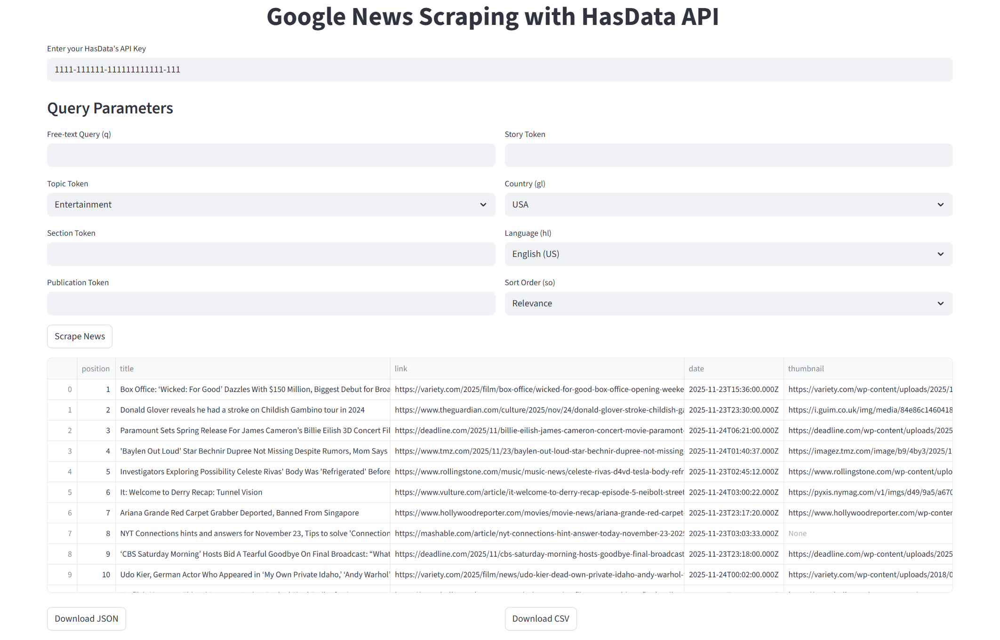

# Google News Scraper with HasData API

[](https://hasdata.com/)

This Streamlit app lets you scrape **Google News** directly using the **HasData Google News API**. 
You can choose a topic, set search keywords, filter by country, language, or sort order, and fetch structured news data. The results can be previewed in the app and downloaded as JSON or CSV.

It’s useful for researchers, analysts, developers, or anyone who needs organized news data without coding.

## 🚀 What This App Does

You provide your HasData API key, select a topic or use a custom TopicToken, optionally fill section, publication, or story tokens, and define filters for country, language, and sort order.
[](https://news-scraper-hasdata.streamlit.app/)
The app sends your query to HasData’s API, fetches the results, and shows them in a clean table with all relevant fields like title, link, source, authors, thumbnails, and stories JSON.

You can download the results as **JSON** or **CSV** for further analysis or integration into workflows.

## 🛠️ Installation

Requires Python 3.11+.

```bash
pip install streamlit pandas requests
```

## ▶️ Run the App

```bash
streamlit run app.py
```

Replace `app.py` with your filename if different.

## How It Works

Enter your API key and choose your query parameters. You can select one of the predefined topics or provide a custom TopicToken. You can also filter by country, language, and sort order. Press **Scrape News** to fetch the results.

Each news item includes:

* Position in feed
* Title and link
* Source name and authors
* Publication date
* Thumbnail images
* Stories JSON

The results appear in a table and can be downloaded directly.

## Output

The exported files include all displayed fields, making it easy to feed the data into dashboards, analysis scripts, or reporting pipelines.

## Disclaimer

These examples are for **educational purposes** only. Learn more about [the legality of web scraping](https://hasdata.com/blog/is-web-scraping-legal).

## 📎 More Resources

* [Scraping Google News: The 2025 Python Guide](https://hasdata.com/blog/web-scraping-google-news)
* [HasData Google News API](https://hasdata.com/google-news-api)
* [Join the community on Discord](https://hasdata.com/join-discord)

* [Star this repo if helpful ⭐](#)

